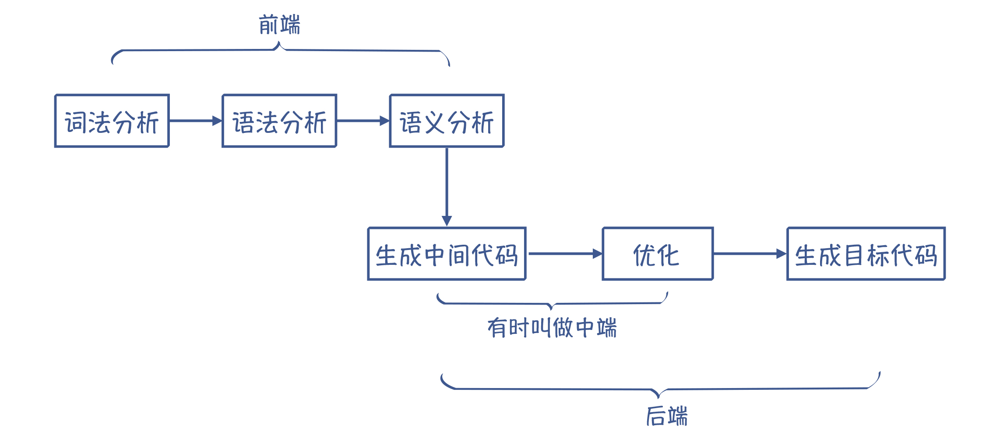
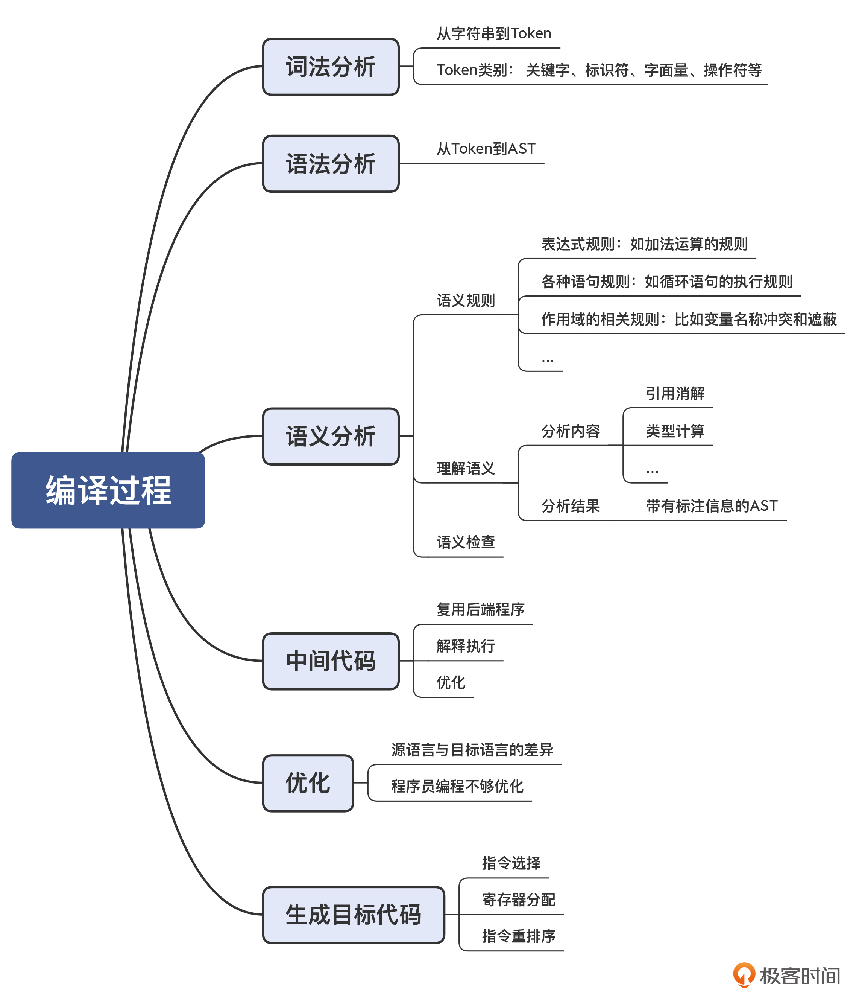
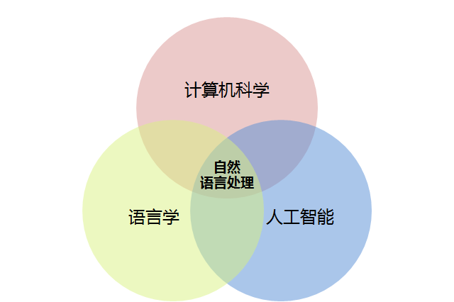

## 编译全过程



### 词法分析（Lexical Analysis）
* 把字符串转换为Token的过程

### 语法分析（Syntactic Analysis）
* 让编译器理解语法结构的过程
* 把Token串转换成一个体现语法规则的、树状的数据结构。（抽象语法树AST，Abstract Syntax Tree）

### 语义分析（Semantic Analysis）
* 每个AST节点上附加一些语义规则
* AST加上定义的语义规则，就能完整地反映源代码的含义
* 解释执行代码的过程，就相当于写了一个基于AST的解释器
* 跟正确的变量定义关联的过程，就叫引用消解（Resolve）. ->局部变量与全局变量同名
* 语义分析的重要特点：做上下文相关的分析
* 语义分析获得的一些信息（引用消解信息、类型信息等），会附加到AST上。带有标注信息的AST（Annotated AST/Decorated AST）可以更全面地反映源代码的含义。
* 语义分析阶段，编译器会做语义理解和语义检查工作。

### 目标代码
* 指汇编代码，是汇编器(Assembler)所能理解的语言，跟机器码有直接的对应关系。汇编器能够将汇编代码转换成机器码
* 对于不同架构的CPU，需要生成不同的汇编代码

### 中间代码（Intermediate Representation, IR）
*  中间代码（IR）,是处于源代码和目标代码之间的一种表示形式
*  倾向于使用IR的原因
   *  1.很多解释型语言可以直接执行IR，比如Python和Java。->没必要生成最终的汇编代码
   *  2.非常重要：生成代码时需要做大量的优化工作，可以基于IR采用统一的算法来进行优化。->没必要基于汇编代码做优化

### 优化（Optimization）
* 需要做优化工作的原因
  * 1.源语言和目标语言有差异。-> 源语言的设计目的是方便人类表达和理解，而目标语言是为了让机器理解
  * 2.内联（inlining）:把原程序中的函数调用去掉，把函数内的逻辑直接嵌入函数调用者的代码中。->Java的JIT编译器（把字节码编译成本地代码）很重要工作就是实现内联优化
* 程序员写的代码不是最优的，而编译器会帮我们做纠正

### 生成目标代码
* 选择合适的指令，生成性能最高的代码
* 优化寄存器的分配，让频繁访问的变量(比如循环变量)放到寄存器中。->寄存器比内存访问速度快100倍左右
* 在不改变运行结果的情况下，对指令做重新排序，从而充分运用CPU内部的多个功能部件的并行计算能力



### 扩展知识：编程语言与自然语言的异同

研究自然语言处理，需要同时具备计算机科学、语言学和人工智能领域的相关知识。与编程语言相比，自然语言的复杂性明显高得多。



* 词汇量：自然语言中的词汇要远比编程语言中的关键词丰富
* 机构化：自然语言是非结构化的，而编程语言是结构化的
* 歧义性：自然语言含有大量歧义，这些歧义根据语境的不同而表现为特定的义项
* 容错性：自然语言有很强的容错性（程序必须保证拼写绝对正确，自然语言更随意，也容许有错误表达）
* 易变性：任何语言都是在不断发生变化的，不同的是，编程语言的变化要缓慢得多，而自然语言则相对迅速一些（编程语言的变化缓慢又小，自然语言的变化随着社会发展）
* 简略性：说话速度，听话速度，书写速度和阅读速度限制，无需重复前面的事实，机构名简称，上下文指代，双方共有而计算机不一定拥有（编程语言要求准确细致满足所有运行条件，自然语言简略干练形式不限）      

```
* 计算机语言编译和自然语言的翻译，做的事情本质上都是输入“遵循某种文法所说出的话”，输出“按照另外一种文法，把同样的话给表达出来”
* 处理的文法是不一样复杂的，自然语言是0型文法，而计算机语言的处理基本上都是在2型文法和3型文法的层面上，只有涉及意义处理才会做一些1型文法层面的事儿。
* 而自然语言，中文、英文这些语言的历史包袱很重，而且语言最初设计的目的也不是为了给机器去跑，而是服务于广大人民群众呀～
* 按形式语言这门学科的定义，自然语言对应的是图灵机，所以对自然语言的处理已经是AI领域研究的范畴～
```

[编程语言有与自然语言](https://www.zhihu.com/question/358491132/answer/1010503138)