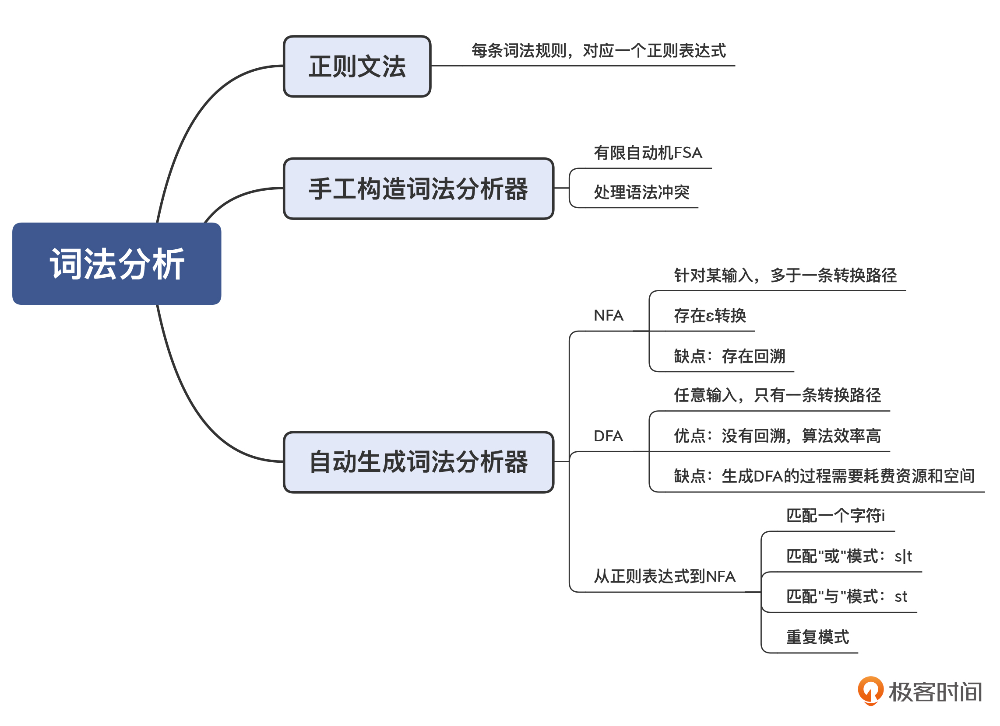

## 词法分析的原理

### 有限自动机(Finite-state Automaton, FSA),有限状态自动机(Finite-state Machine, FSM)
* 词法分析(Tokenizer)的过程，是对一个字符串进行模式匹配的过程->正则表达式工具
* 正则文法(Regular Grammar): 描述词法规则，每个词法规则都采用"Token类型：正则表达式"。 -> Id: [A-Za-z][A-Za-z0-9]

### 从正则表达式生成有限自动机
* 词法分析器生成工具lex(及GNU版本的flex)能够基于规则自动生成词法分析器。->把一个正则表达式翻译成NFA，然后把NFA转换成DFA。
* DFA(Deterministic Finite Automaton),确定的有限自动机：该状态机在任何一个状态，基于输入的字符，都能做一个确定的状态转换。
* NFA(Nondeterministic Finite Automaton),不确定的有限自动机：该状态机在某些状态，针对某些输入，不能做一个确定的转换。
* 所有正则表达式都能转换成NFA或DFA；而所有的NFA或DFA，也都能转换成正则表达式。
* 能否将 NFA 转换成 DFA，让字符串的匹配过程更简单呢？->子集构造法

